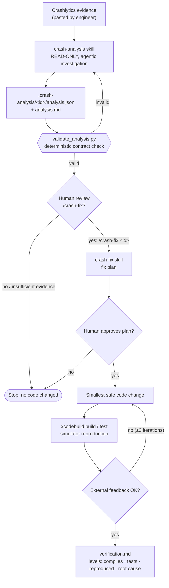
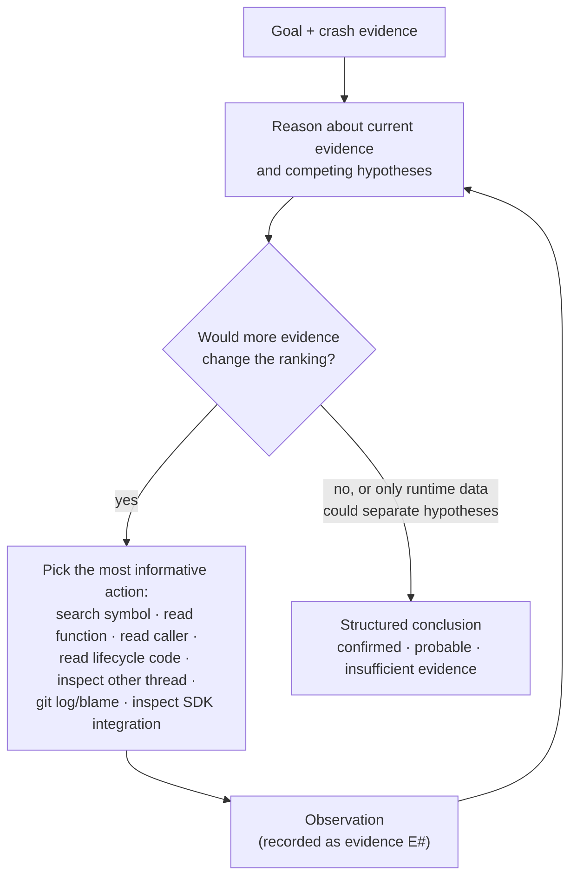

# ios-agentic-toolkit

Reusable, supervised agentic workflows for real iOS engineering work, packaged
as a [Claude Code](https://docs.claude.com/en/docs/claude-code) plugin.

This is not an iOS app and not one giant autonomous agent. It is a small set of
engineering rules, skills, contracts, deterministic tools and evaluation
criteria that Claude Code uses **inside your own iOS repositories**. It grows
one workflow at a time, and only when a real use case needs one.

**Implemented today:** iOS crash investigation (read-only) and
approval-gated crash fixing.

---

## Why this exists

Coding agents are good at reading unfamiliar code and correlating signals.
They are also prone to two failure modes that matter in production iOS work:

1. **Overclaiming:** jumping from the top stack frame to a confident root cause,
   or calling a crash "fixed" because the code compiles.
2. **Over-acting:** editing code before the problem is understood, or widening a
   fix into a refactor.

This toolkit encodes the counter-measures as reusable parts: explicit evidence
discipline, a structured contract between investigation and fix, human
approval gates, and verification that reports what was actually verified.

## Design philosophy: hybrid deterministic + agentic

Use deterministic mechanisms wherever behavior can be reliably specified, and
agentic reasoning only where the task needs judgment: interpreting incomplete
evidence, exploring an unfamiliar codebase, deciding what to inspect next,
forming and ranking hypotheses.

No agents, subagents, MCP servers or LLM calls are added because they are
possible. Each one must earn its place.

## Architecture



Two skills with a stable JSON contract between them, a deterministic gate,
and two human decisions. There is no separate orchestrator: the **workflow** is
the skills plus the contract plus the human gates.

## The investigation loop

The crash-analysis skill does not follow a fixed script. It runs an
observe → reason → act loop and decides which evidence to fetch next:



## Rules, skills, agents, workflows

| Concept | Meaning here | In this repo |
|---|---|---|
| **Rule** | A general engineering constraint, independent of domain | [`rules/ios-engineering.md`](rules/ios-engineering.md) |
| **Skill** | Reusable knowledge + procedure for a domain task, loaded on demand | [`skills/crash-analysis`](skills/crash-analysis/SKILL.md), [`skills/crash-fix`](skills/crash-fix/SKILL.md) |
| **Agent / subagent** | A separate reasoning context, justified by isolation or focus | None in V1 (see Design decisions) |
| **Workflow** | Coordination of skills, deterministic steps and human decisions | Analysis → contract → approval → fix → verification |
| **Contract** | Stable structured output that another step consumes | [`schemas/crash-analysis.schema.json`](schemas/crash-analysis.schema.json) |
| **Tool** | Deterministic program the agent runs and observes | [`scripts/validate_analysis.py`](scripts/validate_analysis.py), `xcodebuild`, `simctl`, `git` |

## Deterministic vs agentic responsibilities

| Responsibility | Approach |
|---|---|
| Read crash metadata from the pasted report | Agentic (input format is inconsistent; a parser would be brittle) |
| Search and read the repository, git history | Tool execution |
| Decide which code or evidence to inspect next | **Agentic** |
| Correlate breadcrumbs/custom keys with code paths | **Agentic** |
| Generate and rank root-cause hypotheses | **Agentic** |
| Decide whether evidence is sufficient | **Agentic**, constrained by the contract |
| Validate analysis structure and cross-field consistency | **Deterministic** (`validate_analysis.py`) |
| Start a fix | **Human** (`/crash-fix` cannot be triggered by the model) |
| Approve the fix plan, risky or broad changes | **Human** |
| Build, test, simulator runs | **Deterministic** (`xcodebuild`, `simctl`) |
| Interpret compiler/test/runtime results and revise | Deterministic feedback + agentic interpretation |

## Context engineering

The investigator receives **high-signal evidence**, not the repository:

- crash type and message, the crashed thread's frames, other relevant threads
- breadcrumbs/logs, custom keys
- app/build/OS/device distribution, event and user counts

It then loads code **just in time**, following the chain of evidence outward
from the crash site:

```
crash points to PlayerSession.applyQuality(_:)
  → search the symbol, read the function       (engine is an IUO)
  → where is engine set to nil?                 (background handler)
  → who calls applyQuality?                     (sheet dismissal)
  → do breadcrumbs order these events?          (yes: background before dismiss)
```

Loading hundreds of files up front would dilute attention and cost context
without improving the conclusion. The same principle applies inside the skill:
crash-category reference material is a separate file read only when a category
becomes relevant (progressive disclosure).

The analysis JSON is also a context boundary: `crash-fix` reads the conclusion
and the cited code, instead of reconstructing the investigation.

## Degree of autonomy: supervised

| Stage | Autonomy |
|---|---|
| Crash analysis | Automatic, read-only. Writes only its own report under `.crash-analysis/` |
| Starting a fix | Explicit user command only (`disable-model-invocation`) |
| Applying the fix | After the user approves a written fix plan |
| Widening scope / risky changes | Stops and asks again |
| Commit / push | Only when asked |

This is deliberately not a "find and fix every crash" system.

## Installation

In any iOS repository:

```
/plugin marketplace add rcanbaba/ios-agentic-toolkit
/plugin install ios-agentic-toolkit@ios-agentic-toolkit
```

For local development of the toolkit itself:

```sh
cd ~/path/to/your-ios-app
claude --plugin-dir ~/path/to/ios-agentic-toolkit
```

## Usage

### 1. Crash analysis

What to provide from Crashlytics, in order of value:

| Input | Where in Crashlytics | Why |
|---|---|---|
| Full stack trace (all threads) | Stack trace tab | Crashed thread plus other threads touching the same objects/queues |
| `crash_info_entry_*` keys | Keys tab | Swift `Fatal error:` messages appear only here and are often the most precise evidence |
| Crash session export (JSON) | Logs & Breadcrumbs / session download | Event order before the crash |
| Version/build, OS, device, events, users | Issue header / Data tab | Impact and regression window |
| Other variants' crashed thread | Variants | Can separate competing hypotheses |

Screenshots are optional. Leave out user IDs; the skill redacts them anyway.
Then ask for an analysis, or invoke the skill directly:

```
/crash-analysis <paste report, or path to a file containing it>
```

Output, in the iOS repo (kept out of git via `.git/info/exclude`):

```
.crash-analysis/<issue-id>/analysis.json   # contract
.crash-analysis/<issue-id>/analysis.md     # readable report
```

The skill never edits source code. Ask follow-up questions before deciding.

### 2. Crash fix

```
/crash-fix <issue-id>
```

It validates the analysis, refuses to proceed if the analysis did not justify
a change (unless you explicitly override), presents a fix plan, waits for
approval, implements the smallest change, and runs build/tests/simulator
checks. It then writes `.crash-analysis/<issue-id>/verification.md`, which reports
separately whether the code compiles, tests pass, the crash was reproduced before the fix and not
after, and whether the root cause is confirmed or still probable.

## Example

[`examples/crashes/player-quality-nil-engine`](examples/crashes/player-quality-nil-engine)
is a fully synthetic case:

- [`crashlytics-report.md`](examples/crashes/player-quality-nil-engine/crashlytics-report.md): input
- [`source/`](examples/crashes/player-quality-nil-engine/source): minimal synthetic code
- [`analysis.json`](examples/crashes/player-quality-nil-engine/analysis.json) / [`analysis.md`](examples/crashes/player-quality-nil-engine/analysis.md): expected output

The top frame is `libswiftCore _assertionFailure`; the useful frame is the app
frame below it. The implicit unwrap is the symptom. Breadcrumbs and a custom
key show the engine was released on background before the sheet was
dismissed. The verdict is **probable**, not confirmed, because it has not been
reproduced yet.

```sh
python3 scripts/validate_analysis.py examples/crashes/player-quality-nil-engine/analysis.json
```

## Evaluation

Agentic workflows should be evaluated, not judged by demos.
[`evals/crash-analysis`](evals/crash-analysis/README.md) defines the rubric:
deterministic checks (contract valid, no source changes, gate respected) and
judged criteria (correct component, evidence discipline, calibration,
alternatives considered, verification strategy). It also lists the planned synthetic fixtures,
including cases where **"insufficient evidence" is the correct answer**. The
evaluation is not optimized toward producing a fix.

## Safety and privacy

This repository is public. It never contains company source code, real crash
reports, user identifiers, production stack traces, Firebase configuration,
service-account files or keys. All examples are synthetic. Real analyses are
written inside the target iOS repository under a git-excluded directory, and
the shared rules forbid copying crash data into public places.

## Repository structure

```
.claude-plugin/          plugin + marketplace manifests
rules/                   shared engineering rules (domain-independent)
skills/
  crash-analysis/        read-only investigation skill + category reference
  crash-fix/             approval-gated fix + verification skill
schemas/                 crash-analysis JSON contract
scripts/                 deterministic tools (contract validator)
examples/crashes/        synthetic input/output examples
evals/crash-analysis/    evaluation rubric and fixture plan
```

## Design decisions

- **Skills, not subagents, in V1.** Analysis runs in the main conversation so
  the engineer can question it ("why did you rule out H2?") before approving a
  fix, and so the fix step can reuse what was read. A subagent's main benefit,
  context isolation, has not yet proven necessary; if real investigations
  flood the context, the skill can be switched to a forked context with one
  frontmatter line.
- **Read-only is enforced in layers.** Pre-approved tools are read/search/git
  only. The skill contract forbids edits, and any other write still requires
  permission. Bash is needed for `git log`, so a hard tool sandbox would not be
  airtight anyway. The human gate is the real control.
- **JSON contract + Markdown report.** JSON makes the hand-off to `crash-fix`
  and future evals stable. Markdown is what humans read. The validator checks
  cross-field rules a schema cannot, e.g. hypotheses may only cite recorded
  evidence, and `insufficient_evidence` cannot justify a code change.
- **No crash parser.** Pasted Crashlytics text varies in shape; the model reads
  it reliably. A parser would add brittle code without a demonstrated need.
- **Dependency-free tooling.** The validator uses only the Python standard
  library, which is available on any macOS machine with Xcode tools.
- **Verification levels instead of "fixed".** Compiling, passing tests,
  reproduction before/after and root-cause confirmation are reported
  separately, because they are different claims.

## Roadmap

Ideas only. None of these are implemented, and each will be built only when a
real use case needs it:

- **Design System Extractor:** 3–10 UI reference screenshots → structured,
  reusable design-system contract
- **SwiftUI UI Implementation:** consumes the design-system contract,
  implements UI within the existing project architecture
- **Visual Reviewer:** compares implemented UI with design-system rules and
  feeds violations back to implementation (a candidate for a real subagent)
- **App Store Metadata:** description, subtitle, keywords, review notes
- **App Review Assistant:** preparing responses to App Review
- **Release Precheck**
- **iOS Bug Triage**
- **Firebase/APNs Configuration Audit**
- **Legacy Feature Change Safety**
- **Crashlytics data automation**, if manual pasting proves to be a bottleneck
- **MCP integrations**, only if reuse across multiple systems justifies them

## License

[MIT](LICENSE)
